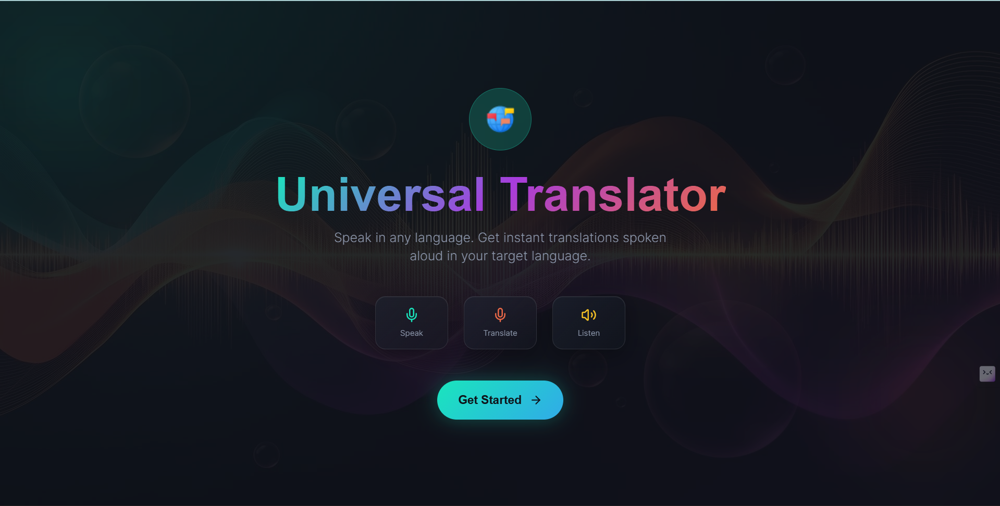
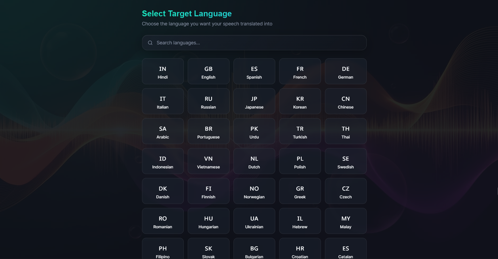
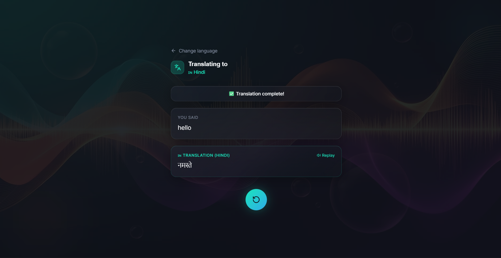

# 🌍 Universal Speak-to-Speak Translator

A real-time multilingual speech translation system that enables seamless communication across languages using voice input, AI-powered translation, and audio/text output.

This application captures spoken language, processes it through speech recognition and translation services, and delivers translated speech and text in real time through an intuitive web interface.

---

## 📌 Overview

Language barriers remain one of the biggest challenges in global communication.
The **Universal Speak-to-Speak Translator** solves this problem by enabling users to speak in one language and instantly receive the translated output in another.

This project integrates modern web technologies with speech recognition and natural language processing to provide an accessible, fast, and scalable translation experience.

---

## ✨ Key Features

✅ Real-time speech recognition
✅ Instant multilingual translation
✅ Speak-to-speak audio output
✅ Text display of original & translated speech
✅ Fast and responsive UI
✅ User-friendly interface
✅ Cross-platform browser support

---

## 🏗️ System Architecture

The application follows a **client–server architecture**:

```
User Speech
     ↓
Frontend (React Interface)
     ↓
Speech Capture & Request
     ↓
Backend API (Flask)
     ↓
Speech Processing & Translation
     ↓
Translated Response
     ↓
Frontend Display & Audio Output
```

---
## UI for Universal Speak-to-Speak Translator

### Welcome UI


### Multiple language Selection 


### Main Translator Interface

---

## 🧩 Technology Stack

### 🔹 Frontend

* React.js
* Vite
* TypeScript
* HTML5 & CSS3

### 🔹 Backend

* Python
* Flask REST API
* SpeechRecognition Library
* Translation API integration

### 🔹 Development Tools

* Node.js & npm
* Git & GitHub
* RESTful API communication

---

## 📁 Project Structure

```
universal-speak-to-speak-translator/
│
├── backend/
│   ├── app.py
│   ├── requirements.txt
│   └── services/
│       ├── speech_processing.py
│       └── translation.py
│
├── frontend/
│   ├── index.html
│   ├── package.json
│   ├── src/
│   │   ├── components/
│   │   ├── App.tsx
│   │   └── styles/
│   └── public/
│
├── README.md
└── .gitignore
```

---

## ⚙️ Installation & Setup

### 🔹 1. Clone Repository

```bash
git clone https://github.com/YOUR-USERNAME/universal-speak-to-speak-translator.git
cd universal-speak-to-speak-translator
```

---

### 🔹 2. Backend Setup (Python)

```bash
cd backend
pip install -r requirements.txt
python app.py
```

Backend runs on:

```
http://localhost:5000
```

---

### 🔹 3. Frontend Setup (React)

Open a new terminal:

```bash
cd frontend
npm install
npm run dev
```

Frontend runs on:

```
http://localhost:5173
```

---

## 🔄 Application Workflow

1. User clicks the microphone button.
2. Speech input is captured via the browser.
3. Audio is converted into text.
4. The text is sent to the backend API.
5. Backend translates the text into the target language.
6. Translated text is returned to the frontend.
7. Output is displayed and optionally played as speech.

---

## 🌍 Supported Use Cases

* Travel communication
* Language learning assistance
* Multilingual meetings
* Accessibility support
* Cross-cultural collaboration

---

## 🔐 Privacy & Data Handling

* Voice data is processed in real time.
* No long-term storage of audio data.
* Designed with privacy-conscious processing.

---

## 🚀 Future Enhancements

* 🌐 Support for additional regional & Indian languages
* 📱 Mobile-first UI improvements
* 🌙 Dark mode support
* 🗂️ Translation history & export
* 🔊 Offline translation capability
* 🤖 Noise filtering & speech enhancement
* ☁️ Cloud deployment & scalability

---

## 🧪 Testing

To run frontend linting:

```bash
npm run lint
```

To preview production build:

```bash
npm run preview
```

---

## 🚀 Deployment Notes

The application can be deployed using:

* **Frontend:** Vercel / Netlify
* **Backend:** Render / Railway / AWS / Azure
* **Containerization:** Docker (optional)

---

## 🤝 Contributing

Contributions are welcome.

1. Fork the repository
2. Create a new branch
3. Commit your changes
4. Submit a pull request

---

## 👨‍💻 Author

**Gaurav Kumar**
B.Tech – Computer Science & Communication Engineering
KIIT Deemed to be University, Bhubaneswar

---

## 📜 License

This project is developed for educational and research purposes.

---

## ⭐ Support

If you find this project useful, consider giving it a ⭐ on GitHub to support the work.
